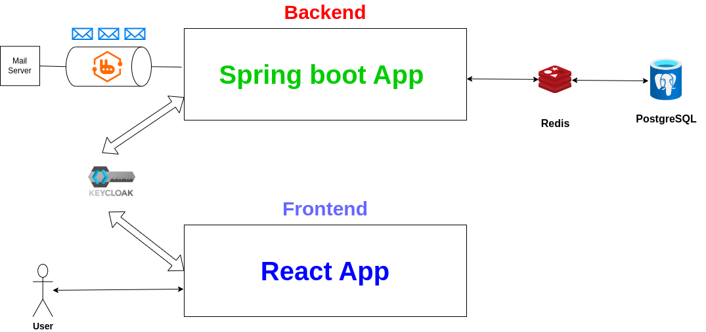

# Library Management System

## Architecture

## Description

Cette application Spring Boot permet de gérer un système de ressources académiques et bibliothécaires. Elle couvre la gestion des emprunteurs (étudiants et enseignants), des facultés, des départements, des travaux (livres et thèses) et des transactions d'emprunt.

Le modèle de données repose sur un schéma relationnel structuré de la manière suivante :
- **borrower** : Table de base contenant les informations générales sur les personnes (emprunteurs).
- **students** : Table spécifique aux étudiants, héritant de *borrower* (clé primaire `student_id` référencée à partir de `borrower_id`).
- **teachers** : Table spécifique aux enseignants, héritant également de *borrower*.
- **faculties** : Contient les informations sur les facultés.
- **departments** : Contient les informations sur les départements et inclut une référence à une faculté.
- **faculties_departments** : Table de jointure liant les facultés et les départements.
- **works** : Regroupe les travaux (livres et thèses).
- **books** : Détails spécifiques aux livres, référencés via *works*.
- **theses** : Détails spécifiques aux thèses, référencés via *works*.
- **borrow_transactions** : Historique des transactions d'emprunt.

Le projet utilise **Flyway** pour gérer les migrations de la base de données.

## Technologies Utilisées

- **Java 21** (ou version ultérieure)
- **Spring Boot** (avec Spring Data JPA, Spring Web, etc.)
- **PostgreSQL** (ou autre SGBD relationnel)
- **Flyway** pour la gestion des migrations de la base de données
- **Maven** (ou Gradle) pour la gestion des dépendances et le build
- **Docker**  pour la gestion des containers.

## Installation et Exécution

### Prérequis

- JDK 21 ou supérieur installé.
- Un SGBD PostgreSQL (ou un autre SGBD compatible) installé et configuré.
- Maven ou Gradle installé sur votre machine.
- Docker.
